# python_labs

## Лабораторная работа 1

# Задание 1

```
name = input()
age = int(input())

print('Привет,' ,name ,'! Через год тебе будет', age +1)
```


# Задание 2

```
a = float(input())
b = float(input())
print('a:' ,a)
print('b:', b)
print('sum=',a + b,'avg=',((a + b) / 2))
```

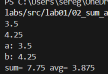

# Задание 3

```
price = float(input())
discount = float(input())
vat = float(input())

base = price * (1 - discount/100)
vat_amount = base * (vat/100)
total = base + vat_amount

print('База после скидки: ',base,'0 ₽',sep = '')
print('НДС: ',vat_amount,'0 ₽',sep = '')
print('Итого к оплате: ',total,'0 ₽',sep = '')
```

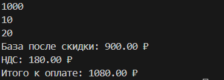

# Задание 4
```
min1 = int(input())

hours = min1 // 60
min2 = min1 % 60

if min1 % 60 != 0:
    print(hours,':',min2,sep = '')

else:
    print(hours,':',min2,'0',sep = '')
    
```

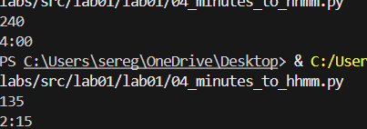

# Задание 5
```
name = input('ФИО: ')

name2 = name.strip()
length = len(name2)

parts = name2.split()
initials = ''.join(word[0].upper() for word in parts)

print('Инициалы:', initials)
print('Длина(символов):',length)
    
```

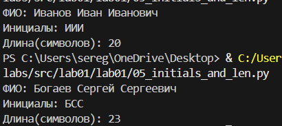

# Задание 6
```
n = int(input())
och = 0
zaoch = 0

for a in range(n):
    line = input().split()
    form = line[-1]
    if form == 'True':
        och +=1 
    else:
        zaoch +=1

print(och, zaoch)
```

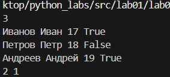

## Лабораторная работа 2

# Задание 1


# min_max

```py
def min_max(nums: list[float | int]) -> tuple[float | int, float | int]:

    if len(nums) == 0:
        raise ValueError
    
    return(min(nums), max(nums))
```

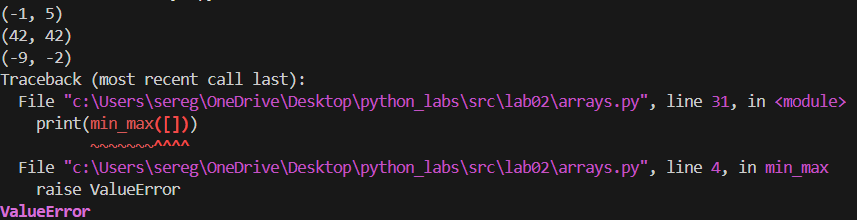

# unique_sorted

```py
def unique_sorted(nums: list[float | int]) -> list[float | int]:

    if len(nums) == 0:
        return []

    return(sorted(set(nums)))
```

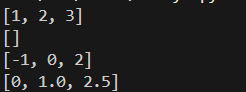

# flatten

```py
def flatten(mat: list[list | tuple]) -> list:

    res = []

    for element in mat:
        if isinstance(element, list) or isinstance(element, tuple):
            for inner_element in element:
                res.append(inner_element)
        else:
            raise TypeError
        
    return res
```

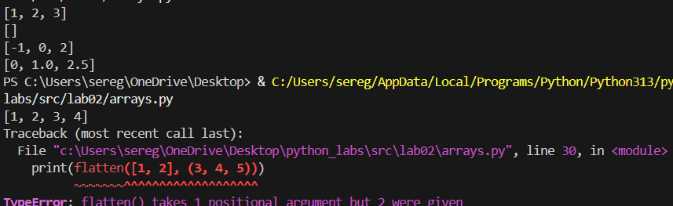

# Задание 2

# transpose

```py
def transpose(mat: list[list[float or int]]) -> list[list]:
    if len(mat) == 0:
        return []
    
    for row in mat:
        if len(mat[0]) != len(row):
            raise ValueError
        
    res = []

    row_cnt = len(mat)
    stolb_cnt = len(mat[0])

    for stolb_index in range(stolb_cnt):
        new_row = []
        for row_index in range(row_cnt):
            new_row.append(mat[row_index][stolb_index])
        res.append(new_row)

    return res

```
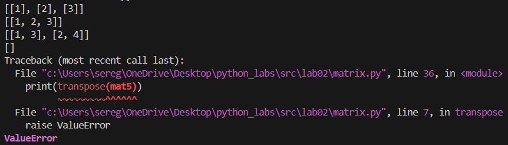

# row_sums

```py
def row_sums(mat: list[list[float or int]]) -> list[float]:

    for row in mat:
        if len(mat[0]) != len(row):
            raise ValueError
        
    res = [sum(row) for row in mat]

    return res
```
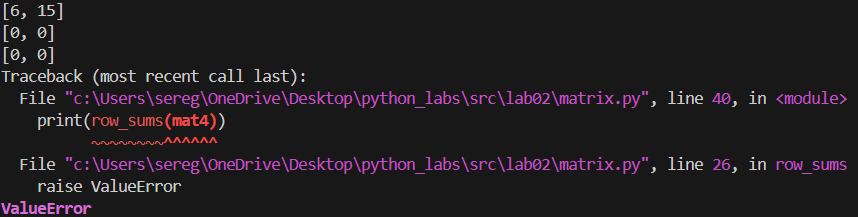

# col_sums

```py
def col_sums(mat: list[list[float | int]]) -> list[float]:

    for row in mat:
        if len(mat[0]) != len(row):
            raise ValueError

    res = [sum(row) for row in zip(*mat)]

    return res

```
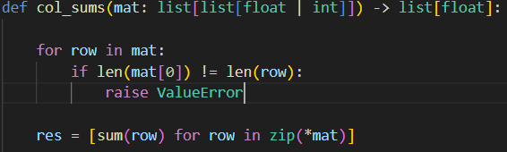

# Задание 3

```py
def format_record(rec: tuple[str, str, float]) -> str:

    fio, group, gpa = rec

    if not isinstance(fio, str) or not fio.strip():
        raise ValueError
    
    if not isinstance(group, str) or not group.strip():
        raise ValueError
    
    if not isinstance(gpa, (int, float)):
        raise TypeError

    cleanned_fio = ' '.join(fio.split())

    fio_parts = cleanned_fio.split()

    if len(fio_parts) < 2:
        raise ValueError    
    
    surname = fio_parts[0].title()

    initials = []

    for name_part in fio_parts[1:]:
        if name_part.strip():
            initial = name_part[0].upper() + '.'
            initials.append(initial)

    if len(initials) > 2:
        initials = initials[:2]

    formatted_fio = f"{surname} {''.join(initials)}"

    cleaned_group = group.strip()

    formatted_gpa = f"{gpa:.2f}"

    return f"{formatted_fio}, гр. {cleaned_group}, GPA {formatted_gpa}"

student1 = ("Иванов Иван Иванович", "BIVT-25", 4.6)
student2 = ("Петров Пётр", "IKBO-12", 5.0)
student3 = ("Петров Пётр Петрович", "IKBO-12", 5.0)
student4 = ("  сидорова  анна   сергеевна ", "ABB-01", 3.999)

print(format_record(student1))
print(format_record(student2))
print(format_record(student3))
print(format_record(student4))

```
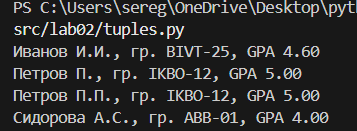

## Лабораторная работа 3

# Задание А

# normalize

```py
def normalize(text: str, *, casefold: bool = True, yo2e: bool = True) -> str:
    if yo2e:
        text = text.replace('Ё','E')
        text = text.replace('ё','е')
    
    text = text.replace('\r',' ').replace('\t',' ').replace('\n',' ')
    text = text.split()
    text = ' '.join(text)
    
    if casefold:
        text = text.casefold()
    
    return text

t1 = "ПрИвЕт\nМИр\t"
t2 = "ёжик, Ёлка"
t3 = "Hello\r\nWorld"
t4 = "  двойные   пробелы  "
```

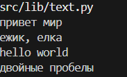

# tokenize

```py
import re 

def tokenize(text: str) -> list[str]:
    pattern = r'\w+(?:-\w+)*'
    return re.findall(pattern, text)

t1 = "привет мир"
t2 = "hello,world!!!"
t3 = "по-настоящему круто"
t4 = "2025 год"
t5 = "emoji 😀 не слово"

print(tokenize(t1), tokenize(t2),tokenize(t3),tokenize(t4),tokenize(t5),sep='\n')
```

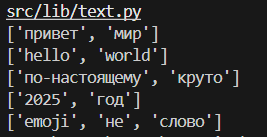

# count_freq + top_n

```py
def count_freq(tokens: list[str]) -> dict[str, int]:
    freq = {}  
    
    for token in tokens:  
        if token in freq:  
            freq[token] += 1  
        else: 
            freq[token] = 1 

    items = list(freq.items())
    items.sort(key = lambda item: (-item[1], item[0]))
    
    return items

tokens1 = ["a","b","a","c","b","a"]
tokens2 = ["bb","aa","bb","aa","cc"]
print(count_freq(tokens1))
print(count_freq(tokens2))
```

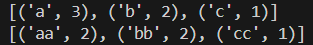

## Задание B

```py
import sys
from lib import text

input_text = sys.stdin.readline()

normalized_text = text.normalize(input_text, casefold = True, yo2e = True)
tokens = text.tokenize(normalized_text)
freq = text.count_freq(tokens)

words_count = len(tokens)
unique_words = len(freq)
top_5 = freq[:5]    

print(f"Всего слов: {words_count}")
print(f"Уникальных слов: {unique_words}")
print("Топ-5:")

for word, count in top_5:
    print(f'{word}:{count}')
```

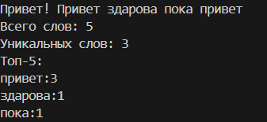

##  Лабораторная работа 4

# Задание А

```py
from pathlib import Path
from typing import Iterable, Sequence
import csv

def read_text(path: str | Path, encoding: str = "utf-8") -> str:  
    """чтобы выбрать кодировку, напишите ее название после encoding="""
    with open(path, "r", encoding=encoding) as file:      
        return file.read()
    
def write_csv(rows: list[tuple | list], path: str | Path, header: tuple[str, ...] | None = None) -> None:
    p = Path(path)
    if p.suffix.lower() != '.csv':
        raise ValueError('Должен быть csv файл')
    rows_list = list(rows)
    Path(path).parent.mkdir(parents=True, exist_ok=True)
    
    if rows:
        first_row_length = len(rows[0])
        for i, row in enumerate(rows):
            if len(row) != first_row_length:
                raise ValueError
            
    if header is not None and rows_list and len(header) != len(rows_list[0]):
        raise ValueError
    
    with p.open('w', newline='', encoding='utf-8') as f:
        w = csv.writer(f)
        if header is not None:
            w.writerows(header)
        w.writerows(rows_list)
```
## Мини-тест

```py
from src.lab04.io_txt_csv import read_text, write_csv
txt = read_text("data/lab04/input.txt")
write_csv([("word","count"),("Анимешник наруто",666)], "data/check.csv")  
```

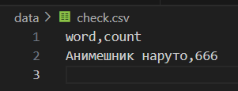

## Задание В

```py
from pathlib import Path
import sys

current_dir = Path(__file__).parent
lib_path = current_dir.parent / "lib"
sys.path.append(str(lib_path))

from text import normalize, tokenize, count_freq

INPUT_FILE = 'data/lab04/input.txt'
OUTPUT_FILE = 'data/lab04/report.csv'
ENCODING = 'utf-8'  

def main():
    if not Path(INPUT_FILE).exists():
        print(f"Ошибка: файл {INPUT_FILE} не найден!")
        print("Создайте файл data/lab04/input.txt с текстом")
        sys.exit(1)
    
    try:
        with open(INPUT_FILE,'r', encoding=ENCODING) as f:
            text = f.read()
        
    except:
         print("Ошибка при чтении файла!")
         sys.exit(1)

    total_words = 0
    unique_words = 0
    word_counts = []

    if not text.strip():
        Path(OUTPUT_FILE).parent.mkdir(exist_ok=True)
        with open(OUTPUT_FILE, 'w', encoding=ENCODING) as f:
            f.write('word,count\n')

    if text.strip():
        clean_text = normalize(text)
        words = tokenize(clean_text)
        word_counts = count_freq(words)

        total_words = len(words)
        unique_words = len(word_counts)

        Path(OUTPUT_FILE).parent.mkdir(exist_ok=True)

        with open(OUTPUT_FILE, 'w', encoding=ENCODING) as f:
            f.write('word,count\n')
            for word,count in word_counts:
                f.write(f'{word},{count}\n')

    print(f'Всего слов: {total_words}')
    print(f'Уникальных слов: {unique_words}')
    print('Топ-5:')
    for word, count in word_counts[:5]:
        print(f'{word}:{count}')

if __name__ == '__main__':
    main()
```
# Коду из задания B был дан текст рассказа "Толстый и тонкий":

# CSV файл:

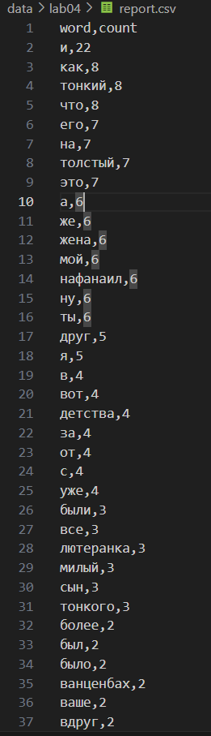

# Консоль:

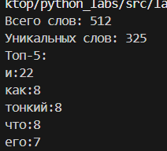

# Пустой файл выводит только заголовок:

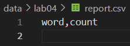

## Лабораторная работа №5

# json -> csv

```py
import json
import csv
from pathlib import Path


def json_to_csv(json_path: str, csv_path: str) -> None:
    if not json_path.lower().endswith('.json'):
        raise ValueError('Входной файл должен иметь расширение .json')
    if not csv_path.lower().endswith('.csv'):
        raise ValueError('Выходной файл должен иметь расширение .csv')

    json_file = Path(json_path)
    csv_file = Path(csv_path)

    if not json_file.exists():
        raise FileNotFoundError('Файл не найден')

    with json_file.open('r', encoding='utf-8') as f:
        content = f.read().strip()
        if not content:
            raise ValueError('JSON-файл пустой')

        try:
            data = json.loads(content)
        except json.JSONDecodeError:
            raise ValueError('Некорректный формат JSON')

    if not isinstance(data, list) or not all(isinstance(x, dict) for x in data):
        raise ValueError('Ожидался список словарей в JSON')
    if not data:
        raise ValueError('JSON файл содержит пустой список')

    headers = list(data[0].keys())
    rows = [{key: obj.get(key, '') for key in headers} for obj in data]

    with csv_file.open('w', encoding='utf-8', newline='') as f:
        writer = csv.DictWriter(f, fieldnames=headers)
        writer.writeheader()
        writer.writerows(rows)

    if csv_file.stat().st_size == 0:
        raise ValueError("CSV-файл получился пустым")


if __name__ == "__main__":
    json_to_csv("data/samples/people.json", "data/out/result1.csv")
```

# на вход программе были даны следующие данные:


# результат вывода

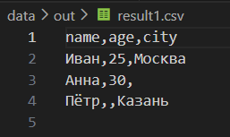

# csv -> json

```py
def csv_to_json(csv_path: str, json_path: str) -> None:

    if not csv_path.lower().endswith('.csv'):
        raise ValueError('Входной файл должен иметь расширение .csv')
    if not json_path.lower().endswith('.json'):
        raise ValueError('Выходной файл должен иметь расширение .json')

    csv_file = Path(csv_path)
    json_file = Path(json_path)

    if not csv_file.exists():
        raise FileNotFoundError("CSV-файл не найден")

    with csv_file.open('r', encoding='utf-8') as f:
        content = f.read().strip()
        if not content:
            raise ValueError("CSV-файл пустой")

    with csv_file.open('r', encoding='utf-8') as f:
        reader = csv.DictReader(f)

        if reader.fieldnames is None:
            raise ValueError("CSV-файл не содержит заголовка")

        rows = list(reader)

    if not rows:
        raise ValueError("CSV-файл не содержит данных")

    original_count = len(rows)

    with json_file.open('w', encoding='utf-8') as f:
        json.dump(rows, f, ensure_ascii=False, indent=2)

    with json_file.open('r', encoding='utf-8') as f:
        try:
            loaded = json.load(f)
        except json.JSONDecodeError:
            raise ValueError("Пустой JSON или некорректная структура")

    if not isinstance(loaded, list):
        raise ValueError("JSON должен содержать список")

    if not all(isinstance(x, dict) for x in loaded):
        raise ValueError("JSON должен содержать список словарей")

    if len(loaded) != original_count:
        raise ValueError("Количество записей не совпадает после конвертации")


if __name__ == "__main__":
    csv_to_json("data/samples/people.csv", "data/out/result2.json")
```

# на вход программе были даны следующие данные:

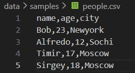


# результат вывода

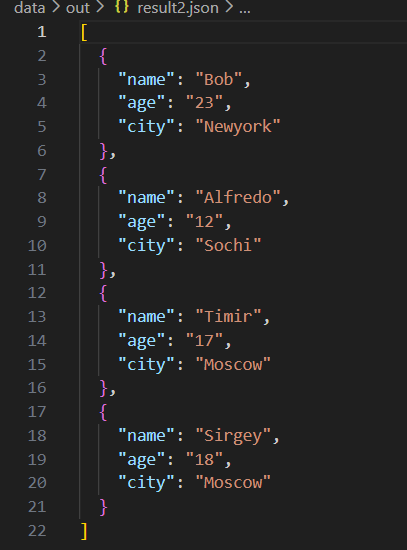

# csv -> xlsx

```py
from openpyxl import Workbook
import csv
import os

def csv_to_xlsx(csv_path: str, xlsx_path: str) -> None:
    if not csv_path.lower().endswith('.csv'):
        raise ValueError('Неверный тип файла, ожидается csv')
    if not xlsx_path.lower().endswith('.xlsx'):
        raise ValueError('Неверный тип файла, ожидается xlsx')
    
    if not os.path.exists(csv_path):
        raise FileNotFoundError('Файл не найден')
    
    try:
        with open(csv_path, 'r', encoding='utf-8') as csv_file:
            csv_reader = csv.reader(csv_file)
            csv_data = list(csv_reader)
    except UnicodeDecodeError:
        raise ValueError('Ошибка кодировки, ожидается utf-8')
    
    if not csv_data:
        raise ValueError('csv файл пуст')
    
    wb = Workbook()
    ws = wb.active
    ws.title = 'Sheet1'

    for row in csv_data:
        ws.append(row)
    
    for column in ws.columns:
        max_length = 0
        column_letter = column[0].column_letter
        for cell in column:
            try:
                max_length = max(max_length, len(str(cell.value)))
            except:
                pass

            
        adjusted_width = max(max_length + 2, 8)

        ws.column_dimensions[column_letter].width = adjusted_width

    wb.save(xlsx_path)

if __name__ == "__main__":
    csv_to_xlsx("data/samples/cities.csv", "data/out/result3.xlsx")
```

# на вход программе были даны следующие данные:

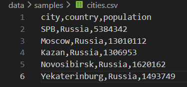

# результат вывода:

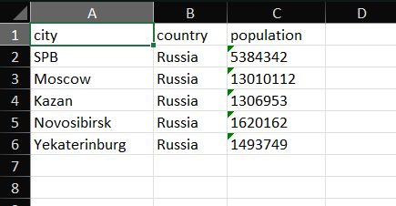

