# python_labs

## Лабораторная работа №10

# structures.py

```py
from collections import deque

class Stack:
    def __init__(self):
        self._data = []
    
    def push(self, item):
        self._data.append(item)
    
    def pop(self):
        if self.is_empty():
            raise IndexError("Пустой стек")
        return self._data.pop()
    
    def peek(self):
        if self.is_empty():
            return None
        return self._data[-1]
    
    def is_empty(self):
        return len(self._data) == 0
    
    def __len__(self):
        return len(self._data)

class Queue:
    def __init__(self):
        self._data = deque()
    
    def enqueue(self, item):
        self._data.append(item)
    
    def dequeue(self):
        if self.is_empty():
            raise IndexError("Пустая очередь")
        return self._data.popleft()
    
    def peek(self):
        if self.is_empty():
            return None
        return self._data[0]
    
    def is_empty(self):
        return len(self._data) == 0
    
    def __len__(self):
        return len(self._data)

if __name__ == "__main__":
    print("Тестирование Stack и Queue\n")
    
    print("1. Тест Stack:")
    s = Stack()
    s.push(10)
    s.push(20)
    s.push(30)
    print(f"  push(10,20,30)")
    print(f"  pop() = {s.pop()}")
    print(f"  peek() = {s.peek()}")
    print(f"  размер = {len(s)}")
    print(f"  пустой? {s.is_empty()}")
    
    print("\n2. Тест Queue:")
    q = Queue()
    q.enqueue("A")
    q.enqueue("B")
    q.enqueue("C")
    print(f"  enqueue(A,B,C)")
    print(f"  dequeue() = {q.dequeue()}")
    print(f"  peek() = {q.peek()}")
    print(f"  размер = {len(q)}")
    print(f"  пустая? {q.is_empty()}")

```

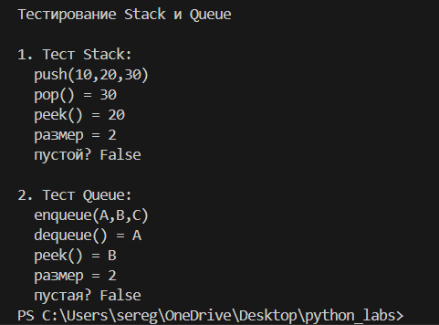

# linked_list.py

```py
class Node:
    def __init__(self, value, next=None):
        self.value = value
        self.next = next

class SinglyLinkedList:
    def __init__(self):
        self.head = None
        self.tail = None
        self._size = 0
    
    def append(self, value):
        new_node = Node(value)
        if self.head is None:
            self.head = new_node
            self.tail = new_node
        else:
            self.tail.next = new_node
            self.tail = new_node
        self._size += 1
    
    def prepend(self, value):
        new_node = Node(value, self.head)
        self.head = new_node
        if self.tail is None:
            self.tail = new_node
        self._size += 1
    
    def insert(self, idx, value):
        if idx < 0 or idx > self._size:
            raise IndexError("Неправильный индекс")
        if idx == 0:
            self.prepend(value)
        elif idx == self._size:
            self.append(value)
        else:
            current = self.head
            for i in range(idx - 1):
                current = current.next
            new_node = Node(value, current.next)
            current.next = new_node
            self._size += 1
    
    def remove_at(self, idx):
        if idx < 0 or idx >= self._size:
            raise IndexError("Неправильный индекс")
        if idx == 0:
            removed = self.head
            self.head = self.head.next
            if self.head is None:
                self.tail = None
        else:
            current = self.head
            for i in range(idx - 1):
                current = current.next
            removed = current.next
            current.next = current.next.next
            if current.next is None:
                self.tail = current
        self._size -= 1
        return removed.value
    
    def __iter__(self):
        current = self.head
        while current is not None:
            yield current.value
            current = current.next
    
    def __len__(self):
        return self._size
    
    def __repr__(self):
        return f"LinkedList({list(self)})"

if __name__ == "__main__":
    print("Тестирование SinglyLinkedList\n")
    
    print("1. Тест SinglyLinkedList:")
    lst = SinglyLinkedList()
    lst.append(10)
    lst.append(20)
    lst.append(30)
    lst.prepend(5)
    lst.insert(2, 15)
    print(f"  append(10,20,30), prepend(5), insert(2,15)")
    print(f"  список: {lst}")
    print(f"  размер: {len(lst)}")
    print(f"  удаляем индекс 2: {lst.remove_at(2)}")
    print(f"  список: {lst}")
    
    print("\n2. Итерация по списку:")
    for item in lst:
        print(f"  - {item}")

```

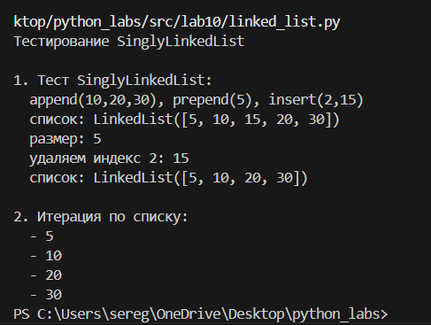


## Лабораторная работа №9

# group.py

```py
import csv
from pathlib import Path
import sys

current_dir = Path(__file__).parent
project_root = current_dir.parent.parent
sys.path.insert(0, str(project_root))

from src.lab08.models import Student

class Group:
    def __init__(self, storage_path: str):
        self.path = Path(storage_path)
        self._ensure_storage_exists()
    
    def _ensure_storage_exists(self):
        if not self.path.exists():
            self.path.parent.mkdir(parents=True, exist_ok=True)
            with open(self.path, 'w', encoding='utf-8', newline='') as file:
                writer = csv.writer(file)
                writer.writerow(['fio', 'birthdate', 'group', 'gpa'])
    
    def _read_all(self):
        students = []
        
        if not self.path.exists():
            return students
        
        with open(self.path, 'r', encoding='utf-8') as file:
            reader = csv.DictReader(file)
            for row in reader:
                student = Student(
                    fio=row['fio'],
                    birthdate=row['birthdate'],
                    group=row['group'],
                    gpa=float(row['gpa'])
                )
                students.append(student)
        
        return students
    
    def list(self):
        return self._read_all()
    
    def add(self, student: Student):
        with open(self.path, 'a', encoding='utf-8', newline='') as file:
            writer = csv.writer(file)
            writer.writerow([student.fio, student.birthdate, 
                           student.group, student.gpa])
    
    def find(self, substr: str):
        all_students = self._read_all()
        found_students = []
        
        for student in all_students:
            if substr.lower() in student.fio.lower():
                found_students.append(student)
        
        return found_students
    
    def remove(self, fio: str):
        students = self._read_all()
        new_students = []
        removed = False
        
        for student in students:
            if student.fio != fio:
                new_students.append(student)
            else:
                removed = True
        
        if removed:
            with open(self.path, 'w', encoding='utf-8', newline='') as file:
                writer = csv.writer(file)
                writer.writerow(['fio', 'birthdate', 'group', 'gpa'])
                
                for student in new_students:
                    writer.writerow([student.fio, student.birthdate, 
                                   student.group, student.gpa])
            return True
        else:
            return False
    
    def update(self, fio: str, **fields):
        students = self._read_all()
        updated = False
        
        for student in students:
            if student.fio == fio:
                for field_name, new_value in fields.items():
                    if hasattr(student, field_name):
                        setattr(student, field_name, new_value)
                        updated = True
        
        if updated:
            with open(self.path, 'w', encoding='utf-8', newline='') as file:
                writer = csv.writer(file)
                writer.writerow(['fio', 'birthdate', 'group', 'gpa'])
                
                for student in students:
                    writer.writerow([student.fio, student.birthdate, 
                                   student.group, student.gpa])
            return True
        else:
            return False
```

# запуск происиходит через run_lab09.py:

```py
import sys
from pathlib import Path

current_dir = Path(__file__).parent
sys.path.insert(0, str(current_dir))

from src.lab09.group import Group
from src.lab08.models import Student

def demo_crud_operations():
    print("Демонстрация CRUD операций")
    print("=" * 40)
    
    group = Group("data/lab09/students.csv")
    
    print("1. Добавляем студентов")
    student1 = Student("Иванов Иван", "2003-10-10", "БИВТ-21-1", 4.3)
    student2 = Student("Петрова Анна", "2002-05-15", "БИВТ-21-2", 4.7)
    student3 = Student("Сидоров Алексей", "2004-03-22", "БИВТ-20-3", 3.9)
    
    group.add(student1)
    group.add(student2)
    group.add(student3)
    
    print("2. Все студенты:")
    for i, student in enumerate(group.list(), 1):
        print(f"{i}. {student.fio}, {student.group}, GPA: {student.gpa}")
    
    print("\n3. Поиск по 'Иванов':")
    found = group.find("Иванов")
    for student in found:
        print(f"Найден: {student.fio}")
    
    print("\n4. Обновляем данные Иванова:")
    group.update("Иванов Иван", gpa=4.5, group="БИВТ-22-1")
    
    print("\n5. Удаляем Петрову:")
    group.remove("Петрова Анна")
    
    print("\n6. Финальный список:")
    for i, student in enumerate(group.list(), 1):
        print(f"{i}. {student.fio}, {student.group}, GPA: {student.gpa}")

if __name__ == "__main__":
    demo_crud_operations()
```

# работа run_lab09.py

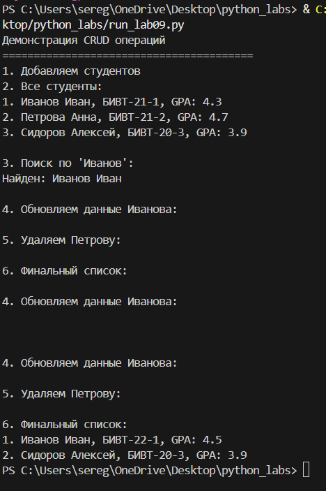


# students.csv после выполнения программы

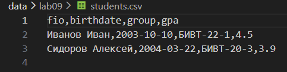


## Лабораторная работа №8

# models

```py
from dataclasses import dataclass
from datetime import datetime, date
import json

@dataclass
class Student:
    fio: str
    birthdate: str
    group: str
    gpa: float
    
    def __post_init__(self):
        try:
            datetime.strptime(self.birthdate, "%Y-%m-%d")
        except ValueError:
            raise ValueError(f"Некорректный формат даты: {self.birthdate}. Ожидается YYYY-MM-DD")
        
        if not (0 <= self.gpa <= 5):
            raise ValueError(f"GPA должен быть в диапазоне от 0 до 5, получено: {self.gpa}")
    
    def age(self) -> int:
        birth_date = datetime.strptime(self.birthdate, "%Y-%m-%d").date()
        today = date.today()
        
        age = today.year - birth_date.year
        
        if (today.month, today.day) < (birth_date.month, birth_date.day):
            age -= 1
        
        return age
    
    def to_dict(self) -> dict:
        return {
            "fio": self.fio,
            "birthdate": self.birthdate,
            "group": self.group,
            "gpa": self.gpa,
            "age": self.age()
        }
    
    @classmethod
    def from_dict(cls, data: dict) -> 'Student':
        data_copy = data.copy()
        data_copy.pop('age', None)
        
        return cls(**data_copy)
    
    def __str__(self) -> str:
        return (f"Студент: {self.fio}\n"
                f"Группа: {self.group}\n"
                f"Дата рождения: {self.birthdate} (Возраст: {self.age()} лет)\n"
                f"Средний балл: {self.gpa:.2f}")
    
    def __repr__(self) -> str:
        return (f"Student(fio={self.fio!r}, birthdate={self.birthdate!r}, "
                f"group={self.group!r}, gpa={self.gpa!r})")
```

# serialize

```py
import json
from pathlib import Path
from typing import List
from .models import Student

def students_to_json(students: List[Student], path: str) -> None:
    data = [student.to_dict() for student in students]
    file_path = Path(path)
    file_path.parent.mkdir(parents=True, exist_ok=True)
    
    with open(file_path, 'w', encoding='utf-8') as f:
        json.dump(data, f, ensure_ascii=False, indent=2)

def students_from_json(path: str) -> List[Student]:
    file_path = Path(path)
    
    if not file_path.exists():
        raise FileNotFoundError(f"Файл не найден: {path}")
    
    with open(file_path, 'r', encoding='utf-8') as f:
        data = json.load(f)
    
    if not isinstance(data, list):
        raise ValueError("Ожидается список студентов в JSON файле")
    
    students = []
    
    for i, item in enumerate(data):
        required_fields = ['fio', 'birthdate', 'group', 'gpa']
        for field in required_fields:
            if field not in item:
                raise ValueError(f"Отсутствует обязательное поле '{field}' у студента {i}")
        
        student = Student.from_dict(item)
        students.append(student)
    
    return students
```

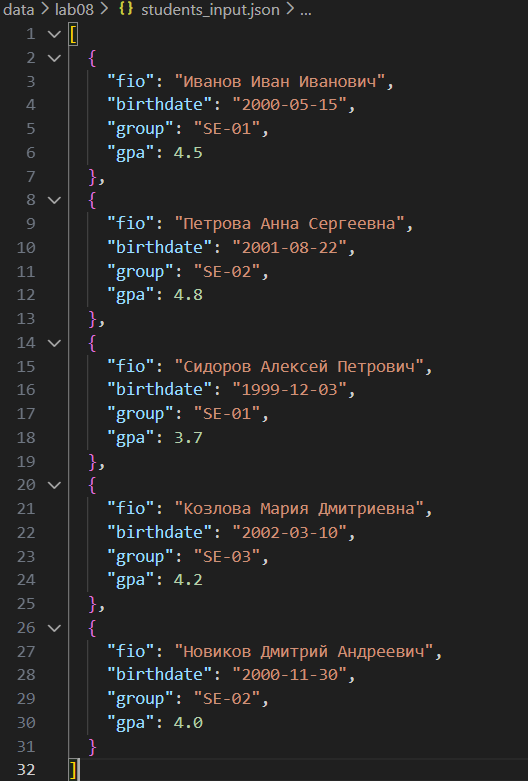

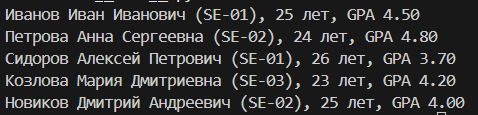


## Лабораторная работа №7

# test_text

```py
import sys
import os

sys.path.insert(0, os.path.join(os.path.dirname(__file__), "..", "src"))

import pytest
from lib.text import normalize, tokenize, count_freq, top_n


@pytest.mark.parametrize(
    "text, expected",
    [
        ("ПрИвЕт МИр", "привет мир"),
        ("Hello World", "hello world"),
        ("  много   пробелов  ", "много пробелов"),
        ("ёжик Ёлка", "ежик eлка"),
        ("", ""),
        ("   ", ""),
        ("ТЕСТ123 test!", "тест123 test!"),
        ("Раз-Два-Три", "раз-два-три"),
    ],
)
def test_normalize(text, expected):
    assert normalize(text) == expected


@pytest.mark.parametrize(
    "text, expected",
    [
        ("привет мир", ["привет", "мир"]),
        ("hello world test", ["hello", "world", "test"]),
        ("один, два. три!", ["один", "два", "три"]),
        ("раз-два три", ["раз-два", "три"]),
        ("", []),
        ("   ", []),
        ("word1 word2 word1", ["word1", "word2", "word1"]),
    ],
)
def test_tokenize(text, expected):
    assert tokenize(text) == expected


@pytest.mark.parametrize(
    "tokens, expected",
    [
        (["кот", "кот", "пёс"], {"кот": 2, "пёс": 1}),
        (["a", "b", "c"], {"a": 1, "b": 1, "c": 1}),
        ([], {}),
        (["word", "word", "word"], {"word": 3}),
        (["a", "a", "b", "b", "c"], {"a": 2, "b": 2, "c": 1}),
    ],
)
def test_count_freq(tokens, expected):
    result = count_freq(tokens)
    assert result == expected


@pytest.mark.parametrize(
    "freq, n, expected",
    [
        ({"кот": 5, "пёс": 3, "мышь": 1}, 2, [("кот", 5), ("пёс", 3)]),
        ({"banana": 2, "apple": 2, "cherry": 1}, 2, [("apple", 2), ("banana", 2)]),
        ({"яблоко": 3, "банан": 3, "вишня": 2}, 2, [("банан", 3), ("яблоко", 3)]),
        ({"a": 1, "b": 2}, 0, []),
        ({"a": 1, "b": 2}, 10, [("b", 2), ("a", 1)]),
        ({}, 5, []),
    ],
)
def test_top_n(freq, n, expected):
    assert top_n(freq, n) == expected


def test_top_n_same_frequency():
    freq = {"zebra": 2, "apple": 2, "banana": 2}
    result = top_n(freq, 3)
    assert result == [("apple", 2), ("banana", 2), ("zebra", 2)]
```

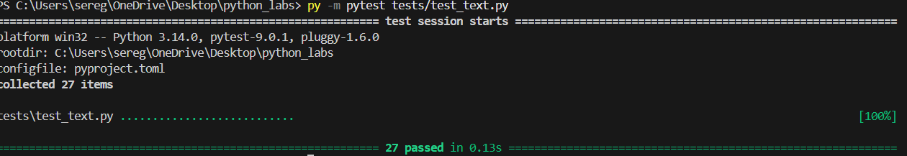

# test_json_csv

```py
import sys
import os

sys.path.insert(0, os.path.join(os.path.dirname(__file__), "..", "src"))

import pytest
import json
import csv
from pathlib import Path
from lab05.json_csv import json_to_csv, csv_to_json


def test_json_to_csv_basic(tmp_path):
    """Тест базовой конвертации JSON -> CSV"""
    json_file = tmp_path / "test.json"
    json_data = [
        {"name": "Иван", "age": 25, "city": "Москва"},
        {"name": "Петр", "age": 30, "city": "СПб"},
    ]
    json_file.write_text(json.dumps(json_data, ensure_ascii=False), encoding="utf-8")

    csv_file = tmp_path / "test.csv"

    json_to_csv(str(json_file), str(csv_file))


    assert csv_file.exists()

    with open(csv_file, "r", encoding="utf-8") as f:
        reader = csv.DictReader(f)
        rows = list(reader)

    assert len(rows) == 2
    assert rows[0]["name"] == "Иван"
    assert rows[0]["age"] == "25"
    assert rows[0]["city"] == "Москва"
    assert rows[1]["name"] == "Петр"
    assert rows[1]["city"] == "СПб"


def test_json_to_csv_empty_list(tmp_path):
    """Тест с пустым списком в JSON"""
    json_file = tmp_path / "test.json"
    json_file.write_text("[]", encoding="utf-8")

    csv_file = tmp_path / "test.csv"

    with pytest.raises(ValueError, match="JSON файл содержит пустой список"):
        json_to_csv(str(json_file), str(csv_file))


def test_json_to_csv_invalid_json(tmp_path):
    """Тест с некорректным JSON"""
    json_file = tmp_path / "test.json"
    json_file.write_text("{ невалидный json }", encoding="utf-8")

    csv_file = tmp_path / "test.csv"

    with pytest.raises(ValueError, match="Некорректный формат JSON"):
        json_to_csv(str(json_file), str(csv_file))


def test_json_to_csv_file_not_found():
    """Тест с несуществующим файлом"""
    with pytest.raises(FileNotFoundError, match="Файл не найден"):
        json_to_csv("nonexistent.json", "output.csv")


def test_json_to_csv_wrong_extension():
    """Тест с неправильным расширением файла"""
    with pytest.raises(ValueError, match="Входной файл должен иметь расширение .json"):
        json_to_csv("file.txt", "output.csv")


def test_json_to_csv_with_different_keys(tmp_path):
    """Тест с разными наборами ключей в объектах - функция берет ключи только из первого объекта"""
    json_file = tmp_path / "test.json"
    json_data = [
        {"name": "Иван", "age": 25},
        {"name": "Петр", "city": "СПб", "age": 30},
    ]
    json_file.write_text(json.dumps(json_data, ensure_ascii=False), encoding="utf-8")

    csv_file = tmp_path / "test.csv"

    json_to_csv(str(json_file), str(csv_file))

    with open(csv_file, "r", encoding="utf-8") as f:
        reader = csv.DictReader(f)
        rows = list(reader)

    assert set(rows[0].keys()) == {"name", "age"}
    assert rows[0]["name"] == "Иван"
    assert rows[0]["age"] == "25"
    assert rows[1]["name"] == "Петр"
    assert rows[1]["age"] == "30"


def test_csv_to_json_basic(tmp_path):
    """Тест базовой конвертации CSV -> JSON"""
    csv_file = tmp_path / "test.csv"
    csv_content = """name,age,city
Иван,25,Москва
Петр,30,СПб"""
    csv_file.write_text(csv_content, encoding="utf-8")

    json_file = tmp_path / "test.json"

    csv_to_json(str(csv_file), str(json_file))

    assert json_file.exists()

    with open(json_file, "r", encoding="utf-8") as f:
        data = json.load(f)

    assert len(data) == 2
    assert data[0]["name"] == "Иван"
    assert data[0]["age"] == "25"
    assert data[0]["city"] == "Москва"
    assert data[1]["name"] == "Петр"
    assert data[1]["city"] == "СПб"


def test_csv_to_json_empty_file(tmp_path):
    """Тест с пустым CSV файлом"""
    csv_file = tmp_path / "test.csv"
    csv_file.write_text("", encoding="utf-8")

    json_file = tmp_path / "test.json"

    with pytest.raises(ValueError, match="CSV-файл пустой"):
        csv_to_json(str(csv_file), str(json_file))


def test_csv_to_json_only_header(tmp_path):
    """Тест с CSV файлом, содержащим только заголовок"""
    csv_file = tmp_path / "test.csv"
    csv_file.write_text("name,age,city", encoding="utf-8")

    json_file = tmp_path / "test.json"

    with pytest.raises(ValueError, match="CSV-файл не содержит данных"):
        csv_to_json(str(csv_file), str(json_file))


def test_csv_to_json_file_not_found():
    """Тест с несуществующим CSV файлом"""
    with pytest.raises(FileNotFoundError, match="CSV-файл не найден"):
        csv_to_json("nonexistent.csv", "output.json")


def test_csv_to_json_wrong_extension():
    """Тест с неправильным расширением файла"""
    with pytest.raises(ValueError, match="Входной файл должен иметь расширение .csv"):
        csv_to_json("file.txt", "output.json")


def test_json_csv_round_trip(tmp_path):
    """Тест на обратимость: JSON -> CSV -> JSON"""
    original_data = [
        {"id": "1", "name": "Тест", "active": "true"},
        {"id": "2", "name": "Пример", "active": "false"},
    ]

    json_file1 = tmp_path / "original.json"
    json_file1.write_text(
        json.dumps(original_data, ensure_ascii=False), encoding="utf-8"
    )

    csv_file = tmp_path / "converted.csv"
    json_to_csv(str(json_file1), str(csv_file))

    json_file2 = tmp_path / "back.json"
    csv_to_json(str(csv_file), str(json_file2))

    with open(json_file2, "r", encoding="utf-8") as f:
        round_trip_data = json.load(f)

    assert len(round_trip_data) == len(original_data)
    for i in range(len(original_data)):
        for key in original_data[i]:
            assert round_trip_data[i][key] == original_data[i][key]


def test_csv_to_json_empty_values(tmp_path):
    """Тест с пустыми значениями в CSV"""
    csv_file = tmp_path / "test.csv"
    csv_content = """name,age,city
Иван,25,
Петр,,СПб"""
    csv_file.write_text(csv_content, encoding="utf-8")

    json_file = tmp_path / "test.json"
    csv_to_json(str(csv_file), str(json_file))

    with open(json_file, "r", encoding="utf-8") as f:
        data = json.load(f)

    assert data[0]["name"] == "Иван"
    assert data[0]["age"] == "25"
    assert data[0]["city"] == ""
    assert data[1]["name"] == "Петр"
    assert data[1]["age"] == ""
    assert data[1]["city"] == "СПб"
```

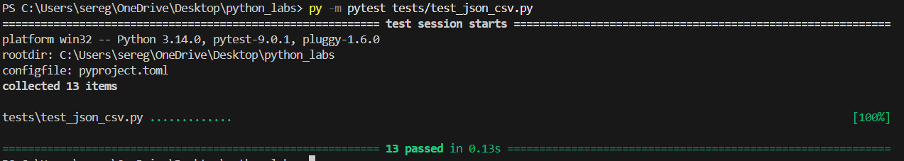

# Команды для запуска

```
pytest tests/test_text.py
py -m pytest tests/test_json_csv.py
```
# Проверка на black

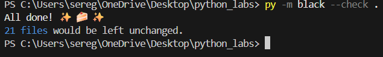

## Лабораторная работа №6

# cli_text

```py
import argparse
import sys
from pathlib import Path

current_file = Path(__file__)
parent_dir = current_file.parent.parent
sys.path.insert(0, str(parent_dir))

from lib.text import normalize, tokenize, count_freq, top_n


def main():
    parser = argparse.ArgumentParser(
        description="CLI утилиты для текста",
        add_help=False
    )

    subparsers = parser.add_subparsers(dest="command", title="доступные команды")

    cat_parser = subparsers.add_parser("cat", help="Показать содержимое файла")
    cat_parser.add_argument("--input", required=True, help="Входной файл")
    cat_parser.add_argument("-n", action="store_true", help="Показать номера строк")

    stats_parser = subparsers.add_parser("stats", help="Статистика по тексту")
    stats_parser.add_argument("--input", required=True, help="Входной файл")
    stats_parser.add_argument("--top", type=int, default=5, help="Количество топ-слов")

    parser.add_argument("-h", "--help", action="help", default=argparse.SUPPRESS, 
                       help="Показать справку")

    args = parser.parse_args()

    if args.command is None:
        return

    if args.command == "cat":
        path = Path(args.input)
        if not path.exists():
            print(f"Ошибка: Файл не найден: {path}")
            sys.exit(1)

        try:
            with open(path, "r", encoding="utf-8") as f:
                lines = f.readlines()
        except Exception as e:
            print(f"Ошибка при чтении файла: {e}")
            sys.exit(1)

        for i, line in enumerate(lines, 1):
            if args.n:
                print(f"{i:6d}  {line}", end="")
            else:
                print(line, end="")

    elif args.command == "stats":
        path = Path(args.input)
        if not path.exists():
            print(f"Ошибка: Файл не найден: {path}")
            sys.exit(1)

        try:
            with open(path, "r", encoding="utf-8") as f:
                text = f.read()
        except Exception as e:
            print(f"Ошибка при чтении файла: {e}")
            sys.exit(1)

        text = normalize(text)
        tokens = tokenize(text)
        freq = count_freq(tokens)
        top_words = top_n(freq, args.top)

        print(f"Всего слов: {len(tokens)}")
        print(f"Уникальных слов: {len(freq)}")
        print(f"Топ-{args.top}:")
        for word, cnt in top_words:
            print(f"  {word}: {cnt}")


if __name__ == "__main__":
    main()
```

# Команды для запуска программы:

```
py -m src.lab06.cli_text cat --input data/samples/input2.txt -n
py -m src.lab06.cli_text stats --input data/samples/input2.txt
```

# Команды для вывода справки:

```
py -m src.lab06.cli_text -h
py -m src.lab06.cli_text cat -h
py -m src.lab06.cli_text stats -h
```

# cli_converter

```py
import argparse
import sys
import os

sys.path.append(os.path.join(os.path.dirname(__file__),'..', 'lab05'))

from json_csv import json_to_csv, csv_to_json
from csv_xlsx import csv_to_xlsx

def main():
    parser = argparse.ArgumentParser(description="Конвертер данных", add_help=False)
    subparsers = parser.add_subparsers(dest="cmd", help="доступные команды")

    parser_json2csv = subparsers.add_parser("json2csv", help="Конвертировать JSON в CSV", add_help=False)
    parser_json2csv.add_argument("--in", dest="input", required=True, help="Входной JSON файл")
    parser_json2csv.add_argument("--out", dest="output", required=True, help="Выходной CSV файл")
    parser_json2csv.add_argument("-h", "--help", action="help", help="Показать эту справку и выйти")

    parser_csv2json = subparsers.add_parser("csv2json", help="Конвертировать CSV в JSON", add_help=False)
    parser_csv2json.add_argument("--in", dest="input", required=True, help="Входной CSV файл")
    parser_csv2json.add_argument("--out", dest="output", required=True, help="Выходной JSON файл")
    parser_csv2json.add_argument("-h", "--help", action="help", help="Показать эту справку и выйти")

    parser_csv2xlsx = subparsers.add_parser("csv2xlsx", help="Конвертировать CSV в XLSX", add_help=False)
    parser_csv2xlsx.add_argument("--in", dest="input", required=True, help="Входной CSV файл")
    parser_csv2xlsx.add_argument("--out", dest="output", required=True, help="Выходной XLSX файл")
    parser_csv2xlsx.add_argument("-h", "--help", action="help", help="Показать эту справку и выйти")

    parser.add_argument("-h", "--help", action="help", help="Показать справку и выйти")

    args = parser.parse_args()

    if not args.cmd:
        return
    
    try:
        if args.cmd == "json2csv":
            json_to_csv(args.input, args.output)
            print(f"Успешно сконвертирован {args.input} в {args.output}")

        elif args.cmd == "csv2json":
            csv_to_json(args.input, args.output)
            print(f"Успешно сконвертирован {args.input} в {args.output}")

        elif args.cmd == "csv2xlsx":
            csv_to_xlsx(args.input, args.output)
            print(f"Успешно сконвертирован {args.input} в {args.output}")

    except FileNotFoundError as e:
        print(f"Ошибка: Файл не найден - {e}")
        sys.exit(1)

    except ValueError as e:
        print(f"Ошибка: Неверные данные - {e}")
        sys.exit(1)

    except Exception as e:
        print(f"Неизвестная ошибка: {e}")
        sys.exit(1)

if __name__ == "__main__":
    main()
```

# Команды для запуска программы:

```
py src/lab06/cli_converter.py json2csv --in data/samples/people.json --out data/out/people.csv
py src/lab06/cli_converter.py csv2json --in data/samples/people.csv --out data/out/people.json
py src/lab06/cli_converter.py csv2xlsx --in data/samples/people.csv --out data/out/people.xlsx
```

# Команды для вывода справки:

```
py src/lab06/cli_converter.py --help
py src/lab06/cli_converter.py json2csv --help
py src/lab06/cli_converter.py csv2json --help
py src/lab06/cli_converter.py csv2xlsx --help
```
## Лабораторная работа №5

# json -> csv

```py
import json
import csv
from pathlib import Path


def json_to_csv(json_path: str, csv_path: str) -> None:
    if not json_path.lower().endswith('.json'):
        raise ValueError('Входной файл должен иметь расширение .json')
    if not csv_path.lower().endswith('.csv'):
        raise ValueError('Выходной файл должен иметь расширение .csv')

    json_file = Path(json_path)
    csv_file = Path(csv_path)

    if not json_file.exists():
        raise FileNotFoundError('Файл не найден')

    with json_file.open('r', encoding='utf-8') as f:
        content = f.read().strip()
        if not content:
            raise ValueError('JSON-файл пустой')

        try:
            data = json.loads(content)
        except json.JSONDecodeError:
            raise ValueError('Некорректный формат JSON')

    if not isinstance(data, list) or not all(isinstance(x, dict) for x in data):
        raise ValueError('Ожидался список словарей в JSON')
    if not data:
        raise ValueError('JSON файл содержит пустой список')

    headers = list(data[0].keys())
    rows = [{key: obj.get(key, '') for key in headers} for obj in data]

    with csv_file.open('w', encoding='utf-8', newline='') as f:
        writer = csv.DictWriter(f, fieldnames=headers)
        writer.writeheader()
        writer.writerows(rows)

    if csv_file.stat().st_size == 0:
        raise ValueError("CSV-файл получился пустым")


if __name__ == "__main__":
    json_to_csv("data/samples/people.json", "data/out/result1.csv")
```

# на вход программе были даны следующие данные:

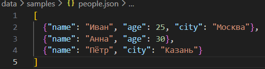

# результат вывода

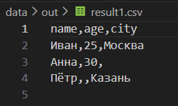

# csv -> json

```py
def csv_to_json(csv_path: str, json_path: str) -> None:

    if not csv_path.lower().endswith('.csv'):
        raise ValueError('Входной файл должен иметь расширение .csv')
    if not json_path.lower().endswith('.json'):
        raise ValueError('Выходной файл должен иметь расширение .json')

    csv_file = Path(csv_path)
    json_file = Path(json_path)

    if not csv_file.exists():
        raise FileNotFoundError("CSV-файл не найден")

    with csv_file.open('r', encoding='utf-8') as f:
        content = f.read().strip()
        if not content:
            raise ValueError("CSV-файл пустой")

    with csv_file.open('r', encoding='utf-8') as f:
        reader = csv.DictReader(f)

        if reader.fieldnames is None:
            raise ValueError("CSV-файл не содержит заголовка")

        rows = list(reader)

    if not rows:
        raise ValueError("CSV-файл не содержит данных")

    original_count = len(rows)

    with json_file.open('w', encoding='utf-8') as f:
        json.dump(rows, f, ensure_ascii=False, indent=2)

    with json_file.open('r', encoding='utf-8') as f:
        try:
            loaded = json.load(f)
        except json.JSONDecodeError:
            raise ValueError("Пустой JSON или некорректная структура")

    if not isinstance(loaded, list):
        raise ValueError("JSON должен содержать список")

    if not all(isinstance(x, dict) for x in loaded):
        raise ValueError("JSON должен содержать список словарей")

    if len(loaded) != original_count:
        raise ValueError("Количество записей не совпадает после конвертации")


if __name__ == "__main__":
    csv_to_json("data/samples/people.csv", "data/out/result2.json")
```

# на вход программе были даны следующие данные:

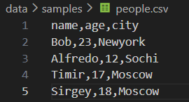


# результат вывода

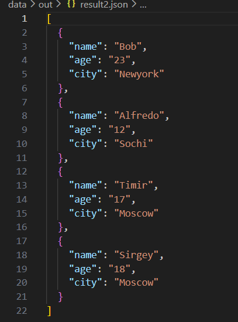

# csv -> xlsx

```py
from openpyxl import Workbook
import csv
import os

def csv_to_xlsx(csv_path: str, xlsx_path: str) -> None:
    if not csv_path.lower().endswith('.csv'):
        raise ValueError('Неверный тип файла, ожидается csv')
    if not xlsx_path.lower().endswith('.xlsx'):
        raise ValueError('Неверный тип файла, ожидается xlsx')
    
    if not os.path.exists(csv_path):
        raise FileNotFoundError('Файл не найден')
    
    try:
        with open(csv_path, 'r', encoding='utf-8') as csv_file:
            csv_reader = csv.reader(csv_file)
            csv_data = list(csv_reader)
    except UnicodeDecodeError:
        raise ValueError('Ошибка кодировки, ожидается utf-8')
    
    if not csv_data:
        raise ValueError('csv файл пуст')
    
    wb = Workbook()
    ws = wb.active
    ws.title = 'Sheet1'

    for row in csv_data:
        ws.append(row)
    
    for column in ws.columns:
        max_length = 0
        column_letter = column[0].column_letter
        for cell in column:
            try:
                max_length = max(max_length, len(str(cell.value)))
            except:
                pass

            
        adjusted_width = max(max_length + 2, 8)

        ws.column_dimensions[column_letter].width = adjusted_width

    wb.save(xlsx_path)

if __name__ == "__main__":
    csv_to_xlsx("data/samples/cities.csv", "data/out/result3.xlsx")
```

# на вход программе были даны следующие данные:

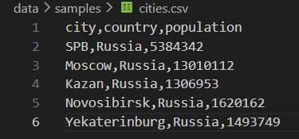

# результат вывода:

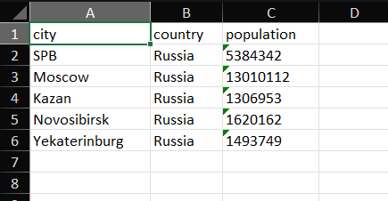

##  Лабораторная работа 4

# Задание А

```py
from pathlib import Path
from typing import Iterable, Sequence
import csv

def read_text(path: str | Path, encoding: str = "utf-8") -> str:  
    """чтобы выбрать кодировку, напишите ее название после encoding="""
    with open(path, "r", encoding=encoding) as file:      
        return file.read()
    
def write_csv(rows: list[tuple | list], path: str | Path, header: tuple[str, ...] | None = None) -> None:
    p = Path(path)
    if p.suffix.lower() != '.csv':
        raise ValueError('Должен быть csv файл')
    rows_list = list(rows)
    Path(path).parent.mkdir(parents=True, exist_ok=True)
    
    if rows:
        first_row_length = len(rows[0])
        for i, row in enumerate(rows):
            if len(row) != first_row_length:
                raise ValueError
            
    if header is not None and rows_list and len(header) != len(rows_list[0]):
        raise ValueError
    
    with p.open('w', newline='', encoding='utf-8') as f:
        w = csv.writer(f)
        if header is not None:
            w.writerows(header)
        w.writerows(rows_list)
```
## Мини-тест

```py
from src.lab04.io_txt_csv import read_text, write_csv
txt = read_text("data/lab04/input.txt")
write_csv([("word","count"),("Анимешник наруто",666)], "data/check.csv")  
```

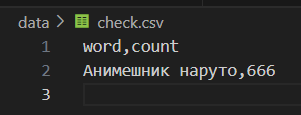

## Задание В

```py
from pathlib import Path
import sys

current_dir = Path(__file__).parent
lib_path = current_dir.parent / "lib"
sys.path.append(str(lib_path))

from text import normalize, tokenize, count_freq

INPUT_FILE = 'data/lab04/input.txt'
OUTPUT_FILE = 'data/lab04/report.csv'
ENCODING = 'utf-8'  

def main():
    if not Path(INPUT_FILE).exists():
        print(f"Ошибка: файл {INPUT_FILE} не найден!")
        print("Создайте файл data/lab04/input.txt с текстом")
        sys.exit(1)
    
    try:
        with open(INPUT_FILE,'r', encoding=ENCODING) as f:
            text = f.read()
        
    except:
         print("Ошибка при чтении файла!")
         sys.exit(1)

    total_words = 0
    unique_words = 0
    word_counts = []

    if not text.strip():
        Path(OUTPUT_FILE).parent.mkdir(exist_ok=True)
        with open(OUTPUT_FILE, 'w', encoding=ENCODING) as f:
            f.write('word,count\n')

    if text.strip():
        clean_text = normalize(text)
        words = tokenize(clean_text)
        word_counts = count_freq(words)

        total_words = len(words)
        unique_words = len(word_counts)

        Path(OUTPUT_FILE).parent.mkdir(exist_ok=True)

        with open(OUTPUT_FILE, 'w', encoding=ENCODING) as f:
            f.write('word,count\n')
            for word,count in word_counts:
                f.write(f'{word},{count}\n')

    print(f'Всего слов: {total_words}')
    print(f'Уникальных слов: {unique_words}')
    print('Топ-5:')
    for word, count in word_counts[:5]:
        print(f'{word}:{count}')

if __name__ == '__main__':
    main()
```
# Коду из задания B был дан текст рассказа "Толстый и тонкий":

# CSV файл:

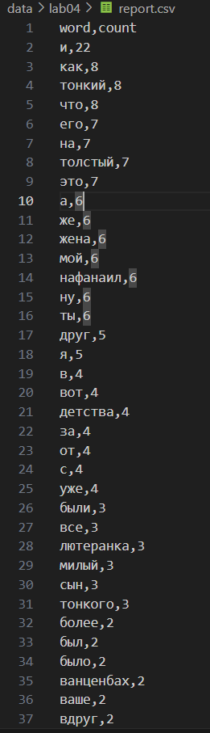

# Консоль:

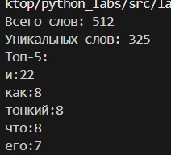

# Пустой файл выводит только заголовок:

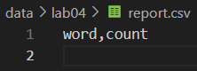

## Лабораторная работа 3

# Задание А

# normalize

```py
def normalize(text: str, *, casefold: bool = True, yo2e: bool = True) -> str:
    if yo2e:
        text = text.replace('Ё','E')
        text = text.replace('ё','е')
    
    text = text.replace('\r',' ').replace('\t',' ').replace('\n',' ')
    text = text.split()
    text = ' '.join(text)
    
    if casefold:
        text = text.casefold()
    
    return text

t1 = "ПрИвЕт\nМИр\t"
t2 = "ёжик, Ёлка"
t3 = "Hello\r\nWorld"
t4 = "  двойные   пробелы  "
```

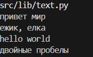

# tokenize

```py
import re 

def tokenize(text: str) -> list[str]:
    pattern = r'\w+(?:-\w+)*'
    return re.findall(pattern, text)

t1 = "привет мир"
t2 = "hello,world!!!"
t3 = "по-настоящему круто"
t4 = "2025 год"
t5 = "emoji 😀 не слово"

print(tokenize(t1), tokenize(t2),tokenize(t3),tokenize(t4),tokenize(t5),sep='\n')
```

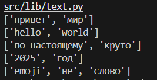

# count_freq + top_n

```py
def count_freq(tokens: list[str]) -> dict[str, int]:
    freq = {}  
    
    for token in tokens:  
        if token in freq:  
            freq[token] += 1  
        else: 
            freq[token] = 1 

    items = list(freq.items())
    items.sort(key = lambda item: (-item[1], item[0]))
    
    return items

tokens1 = ["a","b","a","c","b","a"]
tokens2 = ["bb","aa","bb","aa","cc"]
print(count_freq(tokens1))
print(count_freq(tokens2))
```

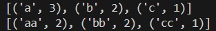

## Задание B

```py
import sys
from lib import text

input_text = sys.stdin.readline()

normalized_text = text.normalize(input_text, casefold = True, yo2e = True)
tokens = text.tokenize(normalized_text)
freq = text.count_freq(tokens)

words_count = len(tokens)
unique_words = len(freq)
top_5 = freq[:5]    

print(f"Всего слов: {words_count}")
print(f"Уникальных слов: {unique_words}")
print("Топ-5:")

for word, count in top_5:
    print(f'{word}:{count}')
```

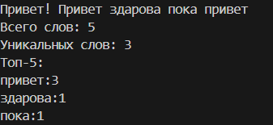

## Лабораторная работа 2

# Задание 1


# min_max

```py
def min_max(nums: list[float | int]) -> tuple[float | int, float | int]:

    if len(nums) == 0:
        raise ValueError
    
    return(min(nums), max(nums))
```

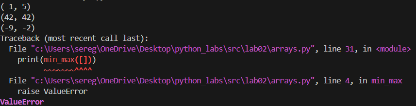

# unique_sorted

```py
def unique_sorted(nums: list[float | int]) -> list[float | int]:

    if len(nums) == 0:
        return []

    return(sorted(set(nums)))
```

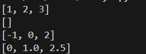

# flatten

```py
def flatten(mat: list[list | tuple]) -> list:

    res = []

    for element in mat:
        if isinstance(element, list) or isinstance(element, tuple):
            for inner_element in element:
                res.append(inner_element)
        else:
            raise TypeError
        
    return res
```

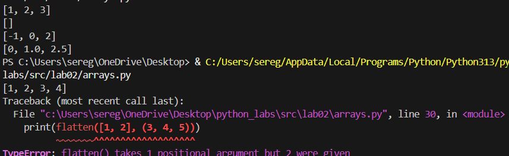

# Задание 2

# transpose

```py
def transpose(mat: list[list[float or int]]) -> list[list]:
    if len(mat) == 0:
        return []
    
    for row in mat:
        if len(mat[0]) != len(row):
            raise ValueError
        
    res = []

    row_cnt = len(mat)
    stolb_cnt = len(mat[0])

    for stolb_index in range(stolb_cnt):
        new_row = []
        for row_index in range(row_cnt):
            new_row.append(mat[row_index][stolb_index])
        res.append(new_row)

    return res

```
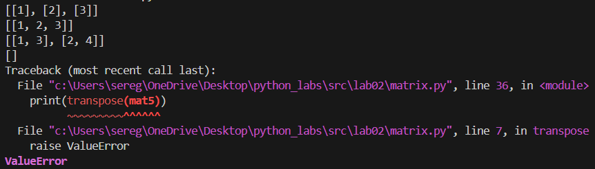

# row_sums

```py
def row_sums(mat: list[list[float or int]]) -> list[float]:

    for row in mat:
        if len(mat[0]) != len(row):
            raise ValueError
        
    res = [sum(row) for row in mat]

    return res
```
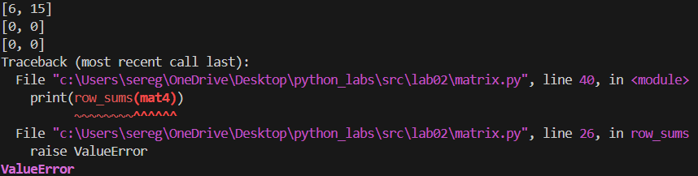

# col_sums

```py
def col_sums(mat: list[list[float | int]]) -> list[float]:

    for row in mat:
        if len(mat[0]) != len(row):
            raise ValueError

    res = [sum(row) for row in zip(*mat)]

    return res

```
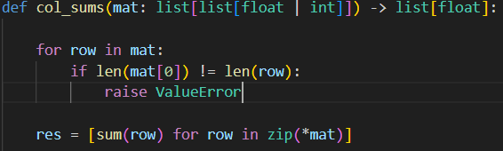

# Задание 3

```py
def format_record(rec: tuple[str, str, float]) -> str:

    fio, group, gpa = rec

    if not isinstance(fio, str) or not fio.strip():
        raise ValueError
    
    if not isinstance(group, str) or not group.strip():
        raise ValueError
    
    if not isinstance(gpa, (int, float)):
        raise TypeError

    cleanned_fio = ' '.join(fio.split())

    fio_parts = cleanned_fio.split()

    if len(fio_parts) < 2:
        raise ValueError    
    
    surname = fio_parts[0].title()

    initials = []

    for name_part in fio_parts[1:]:
        if name_part.strip():
            initial = name_part[0].upper() + '.'
            initials.append(initial)

    if len(initials) > 2:
        initials = initials[:2]

    formatted_fio = f"{surname} {''.join(initials)}"

    cleaned_group = group.strip()

    formatted_gpa = f"{gpa:.2f}"

    return f"{formatted_fio}, гр. {cleaned_group}, GPA {formatted_gpa}"

student1 = ("Иванов Иван Иванович", "BIVT-25", 4.6)
student2 = ("Петров Пётр", "IKBO-12", 5.0)
student3 = ("Петров Пётр Петрович", "IKBO-12", 5.0)
student4 = ("  сидорова  анна   сергеевна ", "ABB-01", 3.999)

print(format_record(student1))
print(format_record(student2))
print(format_record(student3))
print(format_record(student4))

```
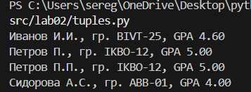


## Лабораторная работа 1

# Задание 1

```
name = input()
age = int(input())

print('Привет,' ,name ,'! Через год тебе будет', age +1)
```
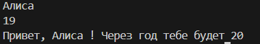

# Задание 2

```
a = float(input())
b = float(input())
print('a:' ,a)
print('b:', b)
print('sum=',a + b,'avg=',((a + b) / 2))
```

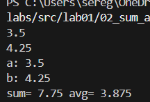

# Задание 3

```
price = float(input())
discount = float(input())
vat = float(input())

base = price * (1 - discount/100)
vat_amount = base * (vat/100)
total = base + vat_amount

print('База после скидки: ',base,'0 ₽',sep = '')
print('НДС: ',vat_amount,'0 ₽',sep = '')
print('Итого к оплате: ',total,'0 ₽',sep = '')
```

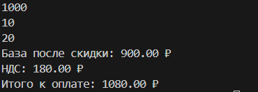

# Задание 4
```
min1 = int(input())

hours = min1 // 60
min2 = min1 % 60

if min1 % 60 != 0:
    print(hours,':',min2,sep = '')

else:
    print(hours,':',min2,'0',sep = '')
    
```

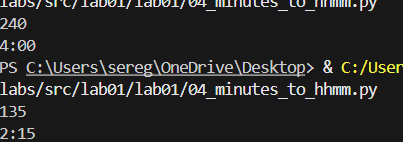

# Задание 5
```
name = input('ФИО: ')

name2 = name.strip()
length = len(name2)

parts = name2.split()
initials = ''.join(word[0].upper() for word in parts)

print('Инициалы:', initials)
print('Длина(символов):',length)
    
```

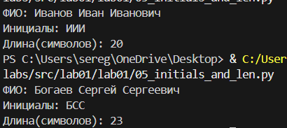

# Задание 6
```
n = int(input())
och = 0
zaoch = 0

for a in range(n):
    line = input().split()
    form = line[-1]
    if form == 'True':
        och +=1 
    else:
        zaoch +=1

print(och, zaoch)
```

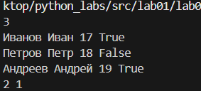

